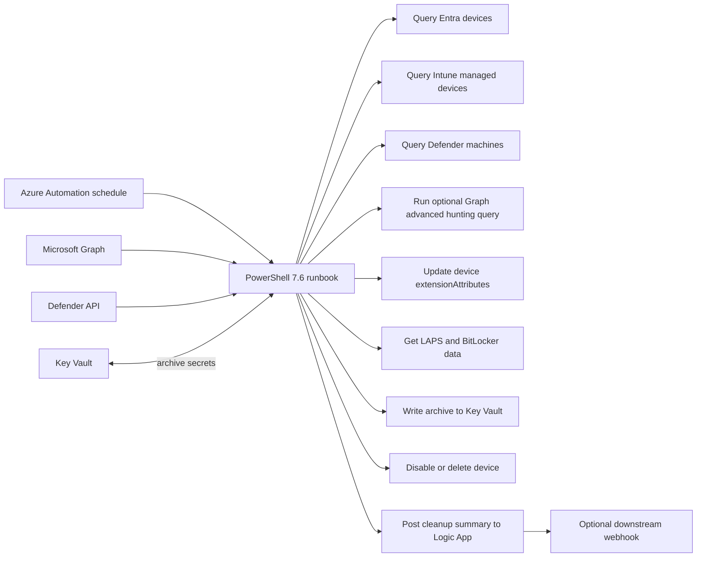
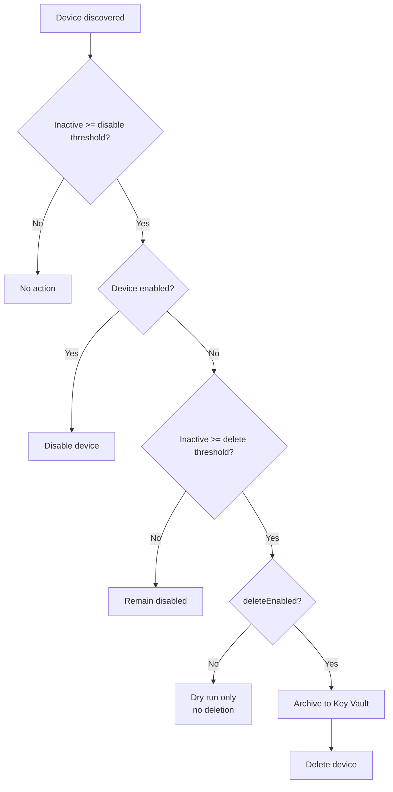

# azd-device-cleanup

`azd-device-cleanup` provisions an **Azure Automation**-based device cleanup workflow that can:

1. disable stale Entra devices after an initial inactivity threshold
2. archive recovery material to Azure Key Vault
3. delete already-disabled devices after a later threshold
4. publish cleanup summaries and failure alerts through an Azure Logic App workflow

The current implementation is intentionally PowerShell-first and **does not use Azure Functions**. It deploys an Automation Account, a PowerShell 7.6 runtime environment, a scheduled runbook, and a standard-tier Key Vault for archived device secrets.

## Default behavior

By default, the solution **does disable stale devices** and **does not delete devices**.

- `disableEnabled=true`
- `deleteEnabled=false`

That means a fresh deployment will start disabling devices that cross the disable threshold, but it **will not archive-and-delete anything** until you explicitly turn deletion on.

## Current scope

This scaffold currently covers **Entra device cleanup**. Before deletion it can archive:

- Windows LAPS local admin passwords
- BitLocker recovery keys
- device metadata such as Entra objectId, deviceId, displayName, OS, and last sign-in
- derived Intune and Defender for Endpoint check-in state on the device object through configurable `extensionAttribute` slots
- advanced hunting heartbeat metadata from Microsoft Graph security queries, including tables such as `DeviceInfo`, `DeviceLogonEvents`, and `IdentityLogonEvents` when present

The archive payload already includes source flags so the same schema can be extended later for Intune and Defender for Endpoint cleanup steps.

## Architecture



1. `azd provision` creates the resource group, Automation Account, PowerShell 7.6 runtime environment, runbook stub, Key Vault, RBAC assignments, and delete lock.
2. `scripts/postprovision.ps1` assigns Microsoft Graph application permissions to the Automation Account managed identity.
3. The same post-provision step publishes `runbooks/DeviceCleanup.ps1`, stamps in the environment-specific defaults, and links it to the Automation schedule.
4. The runbook disables devices at the first threshold, then archives and deletes only devices that are already disabled and have crossed the later threshold.

Missing LAPS or BitLocker data is treated as expected. Retrieval or Key Vault write failures block deletion for that device.

The inactivity decision is based on the **latest available heartbeat**, not only on Entra `approximateLastSignInDateTime`. That makes the workflow safer when a device is still alive in Intune, Defender for Endpoint, or advanced hunting data even if its Entra certificate is broken.

## Lifecycle



## Secret naming and lookup

Secrets use this shape:

`device-cleanup-<sanitized-display-name>-<entra-object-id>`

Each secret also gets tags for:

- `displayName`
- `deviceId`
- `entraObjectId`
- `archivedAt`
- `cleanupSource`

## Archive schema

Each archived device is stored as a JSON secret like:

```json
{
  "schemaVersion": "1.0",
  "archivedAt": "2026-06-29T00:00:00Z",
  "sources": {
    "entra": true,
    "intune": true,
    "defenderForEndpoint": true
  },
  "device": {
    "entraObjectId": "2df5508d-1bb5-4fe0-b4c6-5f8b9d9dc1f1",
    "deviceId": "4a5adf6d-17d2-4c74-9a08-9ca3a6e4ef1e",
    "displayName": "LT-12345",
    "accountEnabled": false,
    "operatingSystem": "Windows",
    "operatingSystemVersion": "11",
    "trustType": "AzureAd",
    "approximateLastSignInDateTime": "2026-03-01T02:30:00Z"
  },
  "intune": {
    "state": "Fresh",
    "lastSyncDateTime": "2026-02-28T00:00:00.0000000Z",
    "managedDeviceId": "managed-device-id",
    "deviceName": "LT-12345",
    "extensionAttributeValue": "Fresh|2026-02-28T00:00:00.0000000Z"
  },
  "defenderForEndpoint": {
    "state": "Fresh",
    "lastSeen": "2026-02-28T00:00:00.0000000Z",
    "machineId": "mde-machine-id",
    "deviceName": "LT-12345",
    "sensorHealthState": "Active",
    "onboardingStatus": "Onboarded",
    "extensionAttributeValue": "Fresh|2026-02-28T00:00:00.0000000Z"
  },
  "heartbeats": {
    "effective": {
      "state": "Fresh",
      "timestamp": "2026-02-28T00:00:00.0000000Z",
      "source": "AdvancedHunting:DeviceLogonEvents",
      "inactiveDays": 2
    },
    "entra": {
      "timestamp": "2026-02-01T00:00:00.0000000Z"
    },
    "intune": {
      "timestamp": "2026-02-28T00:00:00.0000000Z",
      "state": "Fresh",
      "sourceFound": true
    },
    "defenderForEndpoint": {
      "timestamp": "2026-02-28T00:00:00.0000000Z",
      "state": "Fresh",
      "sourceFound": true
    },
    "advancedHunting": [
      {
        "sourceTable": "DeviceInfo",
        "timestamp": "2026-02-28T00:00:00.0000000Z",
        "deviceName": "LT-12345",
        "record": {
          "SourceTable": "DeviceInfo"
        }
      }
    ]
  },
  "laps": {
    "deviceName": "LT-12345",
    "lastBackupDateTime": "2026-02-28T00:00:00Z",
    "refreshDateTime": "2026-03-30T00:00:00Z",
    "credentials": [
      {
        "accountName": "Administrator",
        "accountSid": "S-1-5-21-...",
        "backupDateTime": "2026-02-28T00:00:00Z",
        "password": "RecoveredPassword!"
      }
    ]
  },
  "bitlocker": [
    {
      "id": "7ea6d694-819d-4d95-85a8-50f4ad39b0cb",
      "deviceId": "4a5adf6d-17d2-4c74-9a08-9ca3a6e4ef1e",
      "createdDateTime": "2026-01-15T04:22:00Z",
      "volumeType": "operatingSystemVolume",
      "key": "111111-222222-333333-444444-555555-666666-777777-888888"
    }
  ]
}
```

## Required API application permissions

The Automation Account managed identity needs these **Microsoft Graph** app roles:

- `Device.Read.All`
- `Device.ReadWrite.All`
- `Group.Read.All`
- `GroupMember.Read.All`
- `DeviceManagementManagedDevices.Read.All`
- `ThreatHunting.Read.All` when `advancedHuntingEnabled=true`
- `DeviceLocalCredential.Read.All`
- `BitlockerKey.Read.All`

The identity also needs the Defender for Endpoint application permission `Machine.Read.All` when `defenderCheckInExtensionAttributeNumber` is greater than `0`. `scripts/postprovision.ps1` and `scripts/postprovision.sh` assign the required roles after infrastructure provisioning. `ThreatHunting.Read.All` is assigned only when `advancedHuntingEnabled=true`. `Machine.Read.All` is assigned when the Defender extension attribute is enabled and removed when that source is disabled.

## Configuration

The default deployment wires these settings into the published runbook:

| Setting | Default | Purpose |
| --- | --- | --- |
| `cleanupScheduleFrequency` | `Day` | Runbook cadence |
| `cleanupScheduleInterval` | `1` | Every N days or hours |
| `cleanupScheduleTimeZone` | `UTC` | Schedule time zone |
| `cleanupScheduleStartTime` | computed | Defaults to 15 minutes after deployment unless overridden |
| `logicAppNotificationsEnabled` | `true` | Deploy the Logic App workflow and let the runbook send summary events to it |
| `logicAppNotificationWorkflowName` | computed | Optional Logic App workflow name override |
| `logicAppNotificationWebhookUrl` | empty | Optional secure downstream webhook URL, such as a Teams workflow trigger URL |
| `logicAppNotifyOnSuccess` | `true` | Send notifications for successful runs |
| `logicAppNotifyOnFailure` | `true` | Send notifications for failed runs |
| `logicAppNotifyOnNoAction` | `false` | Send notifications when no disable/delete candidates are found |
| `deviceDisableAfterDays` | `90` | Disable threshold based on inactivity |
| `deviceDeleteAfterDays` | `120` | Delete threshold for already-disabled devices |
| `disableEnabled` | `true` | Default action is to disable stale devices |
| `maxDeleteCount` | `20` | Safety stop for bulk deletion |
| `deleteEnabled` | `false` | **No deletion by default** |
| `exclusionDeviceGroupObjectId` | empty | Optional existing Microsoft Entra security group object ID for devices excluded from disable/delete |
| `exclusionDeviceGroupName` | empty | Optional display name override for the exclusion security group created by post-provision |
| `intuneCheckInExtensionAttributeNumber` | `14` | Device extensionAttribute slot for Intune check-in state; set `0` to disable |
| `defenderCheckInExtensionAttributeNumber` | `15` | Device extensionAttribute slot for Defender check-in state from the Defender machines API; set `0` to disable that source |
| `intuneDynamicGroupEnabled` | `true` | Create or update a dynamic device group for the Intune check-in attribute |
| `intuneDynamicGroupName` | empty | Optional display name override for the Intune dynamic group |
| `intuneDynamicGroupRule` | empty | Optional membership rule override for the Intune dynamic group |
| `defenderDynamicGroupEnabled` | `true` | Create or update a dynamic device group for the Defender check-in attribute |
| `defenderDynamicGroupName` | empty | Optional display name override for the Defender dynamic group |
| `defenderDynamicGroupRule` | empty | Optional membership rule override for the Defender dynamic group |
| `advancedHuntingEnabled` | `true` | Enable optional Microsoft Graph security advanced hunting for supplemental Defender state and heartbeat signals |
| `advancedHuntingLookbackDays` | `30` | Timespan for optional Graph advanced hunting queries; maximum 30 days |
| `secretNamePrefix` | `device-cleanup` | Key Vault secret name prefix |
| `retentionInDays` | `90` | Key Vault soft-delete retention |

## Deployment

1. Sign in to Azure:

   ```powershell
   azd auth login
   ```

2. Optionally configure a downstream notification destination before provisioning:

   ```powershell
   azd env set logicAppNotificationWebhookUrl "<webhook-url>"
   ```

   Leave this unset if you want the Logic App to keep reporting in workflow run history only for now.

3. Provision the solution:

   ```powershell
   azd provision
   ```

   On POSIX systems, the post-provision step expects `pwsh` to be available.

4. Review the resulting environment values:

   ```powershell
   azd env get-values
   ```

5. If you want deletion later, explicitly set:

   - `deleteEnabled=true`

   You can do that in `infra/main.parameters.json` or with `azd env set` before the next `azd provision`.

6. Run the preflight validator before the first production schedule:

   ```powershell
   .\scripts\preflight.ps1
   ```

   This validates the managed identity app roles, Key Vault RBAC and purge-protection configuration, runbook publish state, exclusion/dynamic groups and membership rules, the resource-group delete lock, the Logic App workflow, and a safe Automation dry run with `DisableEnabled=false` and `DeleteEnabled=false`.

## Logic App notifications and reporting

The deployment now creates an **Azure Logic App Consumption workflow** for cleanup reporting by default.

- The runbook posts a normalized JSON summary at the end of each successful run and whenever a run fails.
- The Logic App always records the event in workflow run history.
- If you set `logicAppNotificationWebhookUrl`, the Logic App also forwards the same JSON payload to that downstream webhook.

This keeps the Azure deployment fully automated without requiring pre-authorized connector resources. A simple first use is to point the webhook at a Teams workflow trigger, another Logic App, or any internal HTTP endpoint that should receive cleanup alerts.

The summary payload includes:

- environment, subscription, resource group, automation account, and runbook names
- `cleanupRunId` so notifications and archived device records can be correlated to the same run
- run status and severity
- candidate counts, dry-run counts, executed disable/delete counts, and excluded-device counts
- per-device execution details for disable/archive-delete actions
- failure details when a run terminates with an error

## Exclusion security group

The deployment now creates or reuses one **assigned Microsoft Entra security group** for devices that must never be disabled or deleted by the runbook.

Default name:

- `<AZURE_ENV_NAME> - Device cleanup exclusions`

Use one of these patterns:

- leave both exclusion settings empty and let post-provision create the default group
- set `exclusionDeviceGroupName` to change the created/reused group name
- set `exclusionDeviceGroupObjectId` to point at an existing group you already manage

Add excluded devices directly to that group. The runbook reads the group's direct device membership, still updates Intune and Defender extension attributes for excluded devices, and skips those devices during disable/delete candidate selection.

## Device check-in enrichment

The default deployment writes derived check-in state to:

- `extensionAttribute14` for **Intune**
- `extensionAttribute15` for **Defender for Endpoint**, sourced from the Defender machines API with optional advanced hunting fallback

You can change those slots through `infra\main.parameters.json` or by setting the matching azd environment values before the next `azd provision`. Set either value to `0` to disable that source.

If the main goal is to drive **dynamic device groups** and keep the solution compatible across device types, device `extensionAttribute1-15` remain the best first option over a custom directory extension.

## Heartbeat-aware cleanup logic

The runbook now builds an **effective heartbeat** for each device from the newest available signal across:

- Entra `approximateLastSignInDateTime`
- Intune `managedDevice.lastSyncDateTime`
- Defender for Endpoint `machine.lastSeen` from the machines API
- Optional Microsoft Graph security `runHuntingQuery` results from advanced hunting tables such as:
  - `DeviceInfo`
  - `DeviceLogonEvents`
  - `IdentityLogonEvents`

The Defender machines API is the primary Defender source because it exposes each machine's actual `lastSeen` value according to the tenant's configured retention period, rather than the 30-day raw-data limit of advanced hunting. If any source shows a newer heartbeat than Entra, the newer signal wins for disable/delete decisions. Advanced hunting is supplemental and can serve as a fallback if the machines API is unavailable. If both Defender sources are unavailable, the run preserves existing Defender attributes and skips disable/delete actions rather than treating missing telemetry as proof of inactivity.

Why:

- Microsoft Graph supports writing `extensionAttributes` directly on **device** objects.
- Those device extension attributes are **filterable**.
- Microsoft Entra dynamic device rules support `device.extensionAttribute1` through `device.extensionAttribute15`.
- They are simpler operationally than directory extensions because they are not tied to an owner application definition.

Directory extensions are still a good second-step option when you need:

- more than 15 custom values
- strongly typed custom fields
- app-scoped custom metadata beyond a few string slots

For Intune and Defender check-in, the source attributes to look up are typically:

- **Intune:** `managedDevice.lastSyncDateTime`
- **Defender for Endpoint:** machines API `lastSeen`, with optional advanced hunting `DeviceInfo.LastSeenTime` and supporting event evidence from `DeviceLogonEvents` and `IdentityLogonEvents`

### Attribute value format

Each configured slot stores a string in this format:

`<State>|<Timestamp-or-none>`

Examples:

- `Fresh|2026-06-29T03:00:00.0000000Z`
- `Stale|2026-03-01T00:00:00.0000000Z`
- `Unmanaged|none`
- `NotOnboarded|none`

This keeps the attribute easy to search while still preserving the last-seen timestamp in the same value.

### Default status meanings

| Device attribute | Suggested value | Reason |
| --- | --- | --- |
| `device.extensionAttribute14` | `Fresh`, `Stale`, `Unknown`, `Unmanaged` | Derived from Intune `lastSyncDateTime` |
| `device.extensionAttribute15` | `Fresh`, `Stale`, `Unknown`, `NotOnboarded` | Derived from Defender `lastSeen` |

`Fresh` versus `Stale` uses the same threshold as `deviceDisableAfterDays`. If you also want the raw timestamps independently, they are preserved in the archive payload.

### Dynamic group creation

`azd provision` now creates or updates two **Microsoft Entra dynamic device groups** by default:

- `<AZURE_ENV_NAME> - Intune stale devices`
- `<AZURE_ENV_NAME> - Defender stale devices`

Unless you override the rules, the deployed defaults are:

- Intune: `device.extensionAttribute14 -startsWith "Stale|"`
- Defender: `device.extensionAttribute15 -startsWith "Stale|"`

If you move the source attributes to different slots, the default rules follow the configured attribute numbers automatically. If you want different behavior, override the display names or membership rules through `infra\main.parameters.json` or `azd env set` before the next `azd provision`.

The deployment identity running `scripts\postprovision.ps1` must have sufficient Microsoft Entra permissions to create or update groups in the tenant.

### Dynamic group examples

- Intune stale devices: `device.extensionAttribute14 -startsWith "Stale|"`
- Defender not onboarded devices: `device.extensionAttribute15 -eq "NotOnboarded|none"`

## Archive retrieval

Use `scripts\Get-ArchivedDevice.ps1` to find archived devices and inspect recovery material.

Examples:

```powershell
.\scripts\Get-ArchivedDevice.ps1 -DisplayName "PL-CL02"
.\scripts\Get-ArchivedDevice.ps1 -DeviceId "<device-guid>"
.\\scripts\\Get-ArchivedDevice.ps1 -SerialNumber "<serial-number>"
.\\scripts\\Get-ArchivedDevice.ps1 -IntuneManagedDeviceId "<managed-device-guid>"
.\\scripts\\Get-ArchivedDevice.ps1 -DefenderMachineId "<defender-machine-id>"
.\scripts\Get-ArchivedDevice.ps1 -EntraObjectId "<object-guid>" -ShowRecoveryMaterial
```

The script defaults to summary output so recovery data is not printed accidentally. Add `-ShowRecoveryMaterial` only when you need the LAPS password or BitLocker keys on screen.

Each archived secret now carries searchable metadata in both the JSON payload and Key Vault tags, including:

- Entra object ID and device ID
- Intune managed device ID and serial number when available
- Defender for Endpoint machine ID when available
- per-source last-seen timestamps
- `cleanupRunId` plus the effective heartbeat source and timestamp that drove the delete decision

## Recovery drill and SOP

Before you rely on this in production, run at least one full recovery drill with a non-critical device:

1. Trigger an archive-producing delete path in a safe test scope.
2. Locate the archived record with `scripts\Get-ArchivedDevice.ps1` by display name, device ID, serial number, or one of the source-specific IDs.
3. Confirm the summary view includes the identifiers and heartbeat evidence you expect before revealing recovery material.
4. Re-run with `-ShowRecoveryMaterial` only for the one record you intend to inspect.
5. Validate that the LAPS and BitLocker material is sufficient for your real operator process, then document where your team stores or records the recovery outcome.

This solution preserves **recovery material and cleanup evidence**, not a full device restore workflow. Re-enrollment, domain rejoin, and any downstream Intune or Defender cleanup still follow your existing operational process.

## Access model and RBAC guidance

Use separate access paths for automation and human recovery:

- The Automation Account managed identity should keep only the write access it needs for cleanup and archive creation.
- Human operators who may retrieve LAPS or BitLocker material should be granted the minimum Key Vault data-plane role required for read access, and only on the archive vault.
- Treat archive read access as a privileged recovery action and review it regularly.
- If high-value devices or exclusion groups need tighter control, place them behind a restricted management administrative unit (RMAU) and scope recovery permissions accordingly.

## Operational notes

- The runbook file is `runbooks/DeviceCleanup.ps1`.
- The preflight validator is `scripts/preflight.ps1`.
- The archive retrieval helper is `scripts/Get-ArchivedDevice.ps1`.
- The Automation Account uses a system-assigned managed identity and writes archives to Key Vault through RBAC.
- Defender state uses the Defender for Endpoint machines API as the primary source. Optional Microsoft Graph advanced hunting adds event evidence and can provide a fallback heartbeat.
- The same runbook can update check-in extension attributes across `AzureAd`, `ServerAd`, `Workplace`, and null-trust device types. This was tested in the tenant used for validation.
- Devices in a restricted management administrative unit can reject extensionAttribute updates unless the Automation identity is scoped into that administrative unit. The runbook logs and skips those devices instead of failing the whole run.
- For high-value devices and the groups that protect them, consider a **restricted management administrative unit (RMAU)** so accidental cleanup or group changes require the correct scoped administrative role.
- The Defender machines API uses the tenant's configured machine-retention period. Advanced hunting is optional, limited to a maximum 30-day lookback, and provides supplemental event evidence or a fallback when the machines API is unavailable. If both Defender sources are unavailable, the run skips disable/delete actions for that run.
- If a tenant does not have the required advanced hunting licensing or data sources, set `advancedHuntingEnabled=false`; the Defender machines API can still provide the primary heartbeat and extension-attribute data.
- The resource group gets a `CanNotDelete` lock by default. Remove it before running `azd down`.
- Missing LAPS or BitLocker data does **not** block deletion.
- Archive retrieval or Key Vault write failures **do** block deletion.
- Archived device records now include correlation metadata (`cleanupRunId`, heartbeat source, and per-system identifiers) to make notifications and recovery lookups line up.
- The current implementation deletes only the Entra device. Intune and Defender for Endpoint cleanup can be added around the same archive record later.
