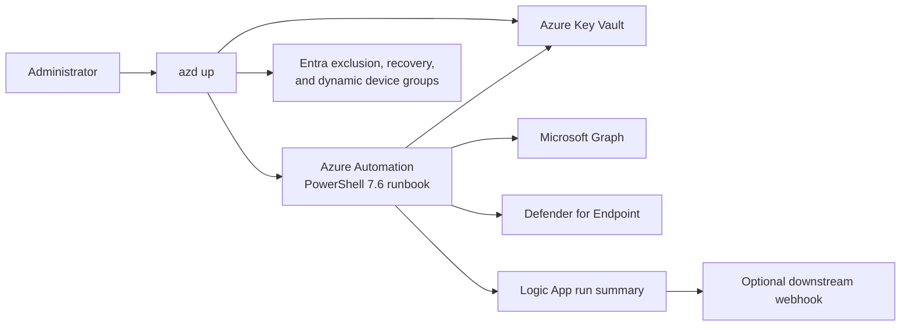

# azd-device-cleanup

Deploy a heartbeat-aware Microsoft Entra device cleanup workflow with Azure Developer CLI.

This template helps an administrator:

1. Identify stale devices from the newest available Entra, Intune, Defender for Endpoint, or advanced-hunting heartbeat.
2. Disable stale Entra devices and protect explicitly excluded devices.
3. Optionally archive LAPS, BitLocker, device, and heartbeat evidence to Azure Key Vault before deleting an already-disabled device.
4. Review cleanup results in Azure Automation and an optional downstream notification workflow.

> [!WARNING]
> A default deployment sets `disableEnabled=true`, schedules the runbook to start about 15 minutes after deployment, and can disable devices that have been inactive for 90 days. Device deletion is disabled by default. Review the exclusion group and run the safe preflight validation immediately after deployment.

## Quickstart

### Before you begin

Install:

- [Azure Developer CLI](https://learn.microsoft.com/azure/developer/azure-developer-cli/install-azd)
- [Azure CLI](https://learn.microsoft.com/cli/azure/install-azure-cli)
- PowerShell 7

Use an administrator who can deploy the Azure resources, create role assignments, grant the required Microsoft Graph and Defender for Endpoint application permissions, and create or update the configured Entra groups. Review [identity and authentication](docs/identity-and-authentication.md) before production deployment.

The hooks reuse the selected Azure CLI session and its normal operating-system broker or browser authentication. Device-code authentication is not required or supported by this deployment guidance.

### Deploy

```powershell
azd init -t nathanmcnulty/azd-device-cleanup && azd up
```

The command deploys Azure resources, grants workload permissions, creates or reuses the configured Entra groups, publishes the runbook, and links its schedule. The default schedule is active, so continue directly to [verification](#verify-the-deployment).

For a deliberately inert first deployment, initialize the template, set `disableEnabled` to `false` in `infra/main.parameters.json`, and then run `azd up`. See [configuration](docs/configuration.md#safe-pilot) for the staged pilot.

## What gets deployed



The Automation Account uses a system-assigned managed identity. It evaluates the newest available heartbeat, writes derived Intune and Defender state to configurable device extension attributes, and disables qualifying devices. When deletion is explicitly enabled, it archives recovery evidence before deleting the Entra device.

The archive contains privileged recovery material. Human recovery access is assigned through the configured recovery group, not directly to the deploying user. See [architecture](docs/architecture.md) and [archive and recovery](docs/archive-and-recovery.md).

## Important choices

| Choice | Default | Administrator impact |
| --- | --- | --- |
| Disable stale devices | Enabled after 90 inactive days | Can change Entra device state on the first scheduled run |
| Delete already-disabled devices | Disabled | Must be enabled explicitly; threshold is 120 inactive days |
| Exclusion group | Created or reused | Direct device members are never disabled or deleted |
| Intune and Defender enrichment | Extension attributes 14 and 15 | Creates or updates matching dynamic stale-device groups |
| Advanced hunting | Enabled, 30-day lookback | Adds supplemental heartbeat evidence when licensed |
| Notifications | Logic App enabled | Run history is retained; downstream webhook is optional |
| Resource-group lock | Enabled | Must be removed explicitly before `azd down` |

All inputs and supported combinations are in [configuration](docs/configuration.md).

## Verify the deployment

Run the preflight validator from the initialized project:

```powershell
.\scripts\preflight.ps1
```

The validator checks workload permissions, Key Vault RBAC and purge protection, groups and membership rules, the published runbook and schedule, the resource-group lock, the Logic App, and a safe Automation job with both disable and delete actions turned off.

Then:

1. Add every protected device to the assigned exclusion group before the production schedule runs.
2. Review the safe preflight job output and the latest Logic App run.
3. Confirm the Automation Account managed identity has only the documented application permissions.
4. Keep `deleteEnabled=false` until a non-critical device passes the documented recovery drill.

Do not consider deletion ready until recovery operators can locate one archive without revealing its secret, reveal only the intended record, and validate the LAPS or BitLocker recovery procedure.

## Documentation

| Guide | Use it for |
| --- | --- |
| [Identity and authentication](docs/identity-and-authentication.md) | Administrator authority, workload permissions, RBAC, authentication, and secret boundaries |
| [Configuration](docs/configuration.md) | Complete defaults, thresholds, groups, enrichment, notifications, and pilot settings |
| [Architecture](docs/architecture.md) | Components, device lifecycle, heartbeat selection, dynamic groups, and trust boundaries |
| [Archive and recovery](docs/archive-and-recovery.md) | Archive schema, lookup commands, recovery material, and the recovery drill |
| [Operations](docs/operations.md) | Verification, reruns, notifications, troubleshooting, and precise cleanup |
| [Agent-assisted deployment](docs/agent-assisted-deployment.md) | Safely deploying while working with an agent |
| [Development](docs/development.md) | Contributor validation, Bicep generation, and publication checks |

## Cleanup

The resource group has a `CanNotDelete` lock. Remove that exact lock, then remove the Azure deployment:

```powershell
$resourceGroup = azd env get-value AZURE_RESOURCE_GROUP
az lock delete --name resource-group-delete-lock --resource-group $resourceGroup
azd down --purge --force
```

This removes the Automation Account, schedule, Logic App, managed identity, and other ARM-managed resources. Key Vault purge protection prevents immediate permanent purge; the soft-deleted vault and archived secrets remain recoverable for the configured retention period.

`azd down` does **not** re-enable or recreate devices, clear device extension attributes, delete the exclusion/recovery/dynamic groups created or reused by post-provisioning, or reverse downstream actions. Review exact group ownership before manual tenant cleanup. See [operations](docs/operations.md#cleanup).

## Security

This workflow can disable devices, read LAPS and BitLocker recovery material, and optionally delete Entra device objects. Keep deletion disabled until the exclusion and recovery processes are proven, restrict recovery-group membership, and treat archive reads as privileged actions.
