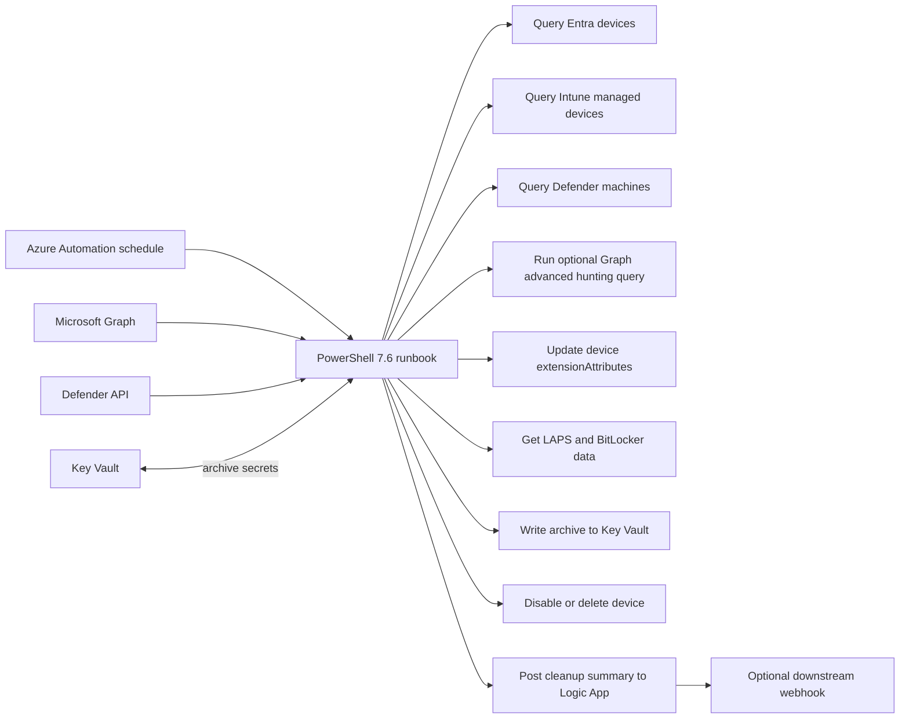
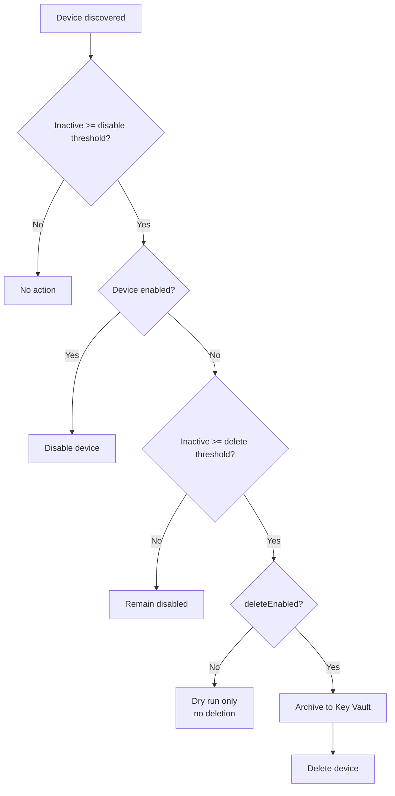

# Architecture

## Current scope

This scaffold currently covers **Entra device cleanup**. Before deletion it can archive:

- Windows LAPS local admin passwords
- BitLocker recovery keys
- device metadata such as Entra objectId, deviceId, displayName, OS, and last sign-in
- derived Intune and Defender for Endpoint check-in state on the device object through configurable `extensionAttribute` slots
- advanced hunting heartbeat metadata from Microsoft Graph security queries, including tables such as `DeviceInfo`, `DeviceLogonEvents`, and `IdentityLogonEvents` when present

The archive payload already includes source flags so the same schema can be extended later for Intune and Defender for Endpoint cleanup steps.

## Architecture

1. `azd provision` creates the resource group, Automation Account, PowerShell 7.6 runtime environment, runbook stub, Key Vault, RBAC assignments, and delete lock.
2. `scripts/postprovision.ps1` assigns Microsoft Graph application permissions to the Automation Account managed identity.
3. The same post-provision step publishes `runbooks/DeviceCleanup.ps1`, stamps in the environment-specific defaults, and links it to the Automation schedule.
4. The runbook disables devices at the first threshold, then archives and deletes only devices that are already disabled and have crossed the later threshold.

Missing LAPS or BitLocker data is treated as expected. Retrieval or Key Vault write failures block deletion for that device, record a partial-run failure, and do not prevent the runbook from processing other candidates.

The inactivity decision is based on the **latest available heartbeat**, not only on Entra `approximateLastSignInDateTime`. That makes the workflow safer when a device is still alive in Intune, Defender for Endpoint, or advanced hunting data even if its Entra certificate is broken.

## Lifecycle

## Device check-in enrichment

The default deployment writes derived check-in state to:

- `extensionAttribute14` for **Intune**
- `extensionAttribute15` for **Defender for Endpoint**, sourced from the Defender machines API with optional advanced hunting fallback

You can change those slots through `infra\main.parameters.json` or by setting the matching azd environment values before the next `azd provision`. Set either value to `0` to disable that source.

If the main goal is to drive **dynamic device groups** and keep the solution compatible across device types, device `extensionAttribute1-15` remain the best first option over a custom directory extension.

## Heartbeat-aware cleanup logic

The runbook now builds an **effective heartbeat** for each device from the newest available signal across:

- Entra `approximateLastSignInDateTime`
- Intune `managedDevice.lastSyncDateTime`
- Defender for Endpoint `machine.lastSeen` from the machines API
- Optional Microsoft Graph security `runHuntingQuery` results from advanced hunting tables such as:
  - `DeviceInfo`
  - `DeviceLogonEvents`
  - `IdentityLogonEvents`

The Defender machines API is the primary Defender source because it exposes each machine's actual `lastSeen` value according to the tenant's configured retention period, rather than the 30-day raw-data limit of advanced hunting. If any source shows a newer heartbeat than Entra, the newer signal wins for disable/delete decisions. Advanced hunting is supplemental and can serve as a fallback if the machines API is unavailable. If both Defender sources are unavailable, the run preserves existing Defender attributes and skips disable/delete actions rather than treating missing telemetry as proof of inactivity.

Why:

- Microsoft Graph supports writing `extensionAttributes` directly on **device** objects.
- Those device extension attributes are **filterable**.
- Microsoft Entra dynamic device rules support `device.extensionAttribute1` through `device.extensionAttribute15`.
- They are simpler operationally than directory extensions because they are not tied to an owner application definition.

Directory extensions are still a good second-step option when you need:

- more than 15 custom values
- strongly typed custom fields
- app-scoped custom metadata beyond a few string slots

For Intune and Defender check-in, the source attributes to look up are typically:

- **Intune:** `managedDevice.lastSyncDateTime`
- **Defender for Endpoint:** machines API `lastSeen`, with optional advanced hunting `DeviceInfo.LastSeenTime` and supporting event evidence from `DeviceLogonEvents` and `IdentityLogonEvents`

### Attribute value format

Each configured slot stores a string in this format:

`<State>|<Timestamp-or-none>`

Examples:

- `Fresh|2026-06-29T03:00:00.0000000Z`
- `Stale|2026-03-01T00:00:00.0000000Z`
- `Unmanaged|none`
- `NotOnboarded|none`

This keeps the attribute easy to search while still preserving the last-seen timestamp in the same value.

### Default status meanings

| Device attribute | Suggested value | Reason |
| --- | --- | --- |
| `device.extensionAttribute14` | `Fresh`, `Stale`, `Unknown`, `Unmanaged` | Derived from Intune `lastSyncDateTime` |
| `device.extensionAttribute15` | `Fresh`, `Stale`, `Unknown`, `NotOnboarded` | Derived from Defender `lastSeen` |

`Fresh` versus `Stale` uses the same threshold as `deviceDisableAfterDays`. If you also want the raw timestamps independently, they are preserved in the archive payload.

### Dynamic group creation

`azd provision` now creates or updates two **Microsoft Entra dynamic device groups** by default:

- `<AZURE_ENV_NAME> - Intune stale devices`
- `<AZURE_ENV_NAME> - Defender stale devices`

Unless you override the rules, the deployed defaults are:

- Intune: `device.extensionAttribute14 -startsWith "Stale|"`
- Defender: `device.extensionAttribute15 -startsWith "Stale|"`

If you move the source attributes to different slots, the default rules follow the configured attribute numbers automatically. If you want different behavior, override the display names or membership rules through `infra\main.parameters.json` or `azd env set` before the next `azd provision`.

The deployment identity running `scripts\postprovision.ps1` must have sufficient Microsoft Entra permissions to create or update groups in the tenant.

### Dynamic group examples

- Intune stale devices: `device.extensionAttribute14 -startsWith "Stale|"`
- Defender not onboarded devices: `device.extensionAttribute15 -eq "NotOnboarded|none"`

## Ownership and state

Azure resources are ARM-managed in the azd resource group. The exclusion, recovery, and dynamic groups are created or reused by the post-provision hook and are not part of ARM cleanup. Device lifecycle changes and extension-attribute writes are tenant state, not deployment state. Archived device records are Key Vault secrets and remain subject to soft-delete retention and purge protection after resource deletion.
